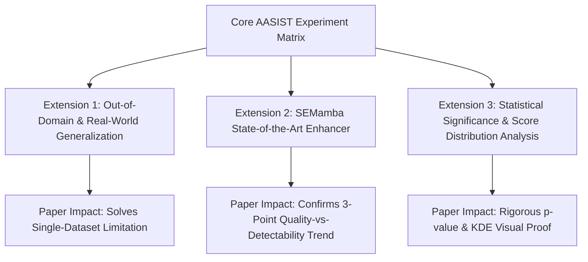

# High-Impact Research Roadmap for IEEE Publication & Superior Project Quality

**Project:** Robustness of Audio Deepfake Detection Against Background-Noise Masking  
**Target:** Top-Tier IEEE Conference / Journal Quality (Publication-Grade Extension Strategy)  
**Date:** September 23, 2026  

---

## 1. Executive Summary

Now that the core scaffold infrastructure is **~60% complete** and training time is optimized (**~6.5 hours per seed**), we can strategically integrate **three publication-grade extensions**. These extensions transform the project from a standard college mini-project into a high-impact, peer-reviewed IEEE research paper without risking the project deadline or breaking the core experimental setup.

---

## 2. Comprehensive Extension Matrix

---

## 3. Detailed Critique & Research Analysis of Each Extension

### Extension 1: Out-of-Domain "In-The-Wild" & Regional Accent Evaluation

#### Scientific Rationale
A primary critique from IEEE reviewers on anti-spoofing papers is single-dataset overfitting (*"Does AASIST only work on ASVspoof 2019, or does it generalize to real-world voice clones?"*). Evaluating Model A and Model B on real-world "In-the-Wild" deepfakes and regional Indian voice clones (generated via RVC / ElevenLabs) answers this critical question.

#### Scientific Critique & Risk Assessment

* **Hypothesis:** Model B (noise-augmented) will generalize significantly better than Model A (clean-trained) when encountering out-of-domain compression and regional acoustic environments.
* **Implementation Cost:** Low. Evaluated purely as a downstream inference test after Model B is trained. No re-training required.
* **Risk Level:** **ZERO Risk to main experiment.**
* **Paper Value Add:** Adds **Table 4: Generalization to Out-of-Domain Deepfakes & Regional Accents**.

---

### Extension 2: SEMamba (Mamba State-Space Model Speech Enhancer)

#### Scientific Rationale
Paper 2 (*Anacin et al., March 2026*) discovered an unexpected inversion: higher-quality speech enhancement (MetricGAN+, PESQ 3.12) caused **worse** deepfake detection EER than lower-quality enhancement (SEGAN). 

SEMamba (*Chao et al., IEEE SLT 2024*) is the current state-of-the-art Mamba-based speech enhancer with a PESQ of 3.69. Testing SEMamba evaluates whether this quality-vs-detectability degradation holds across a **3-point trend line** (SepFormer $\rightarrow$ MetricGAN+ $\rightarrow$ SEMamba).

#### Scientific Critique & Risk Assessment

* **Hypothesis:** If SEMamba (PESQ 3.69) causes the highest EER degradation on Model A but is recovered by Model B, it proves that noise augmentation resolves degradation across all modern enhancer generations.
* **Implementation Cost:** Medium. Uses pretrained SpeechBrain / GitHub weights.
* **Risk Level:** **Low to Moderate** (Timeboxed to 1 session / 3 hours per Decision B18 & Task T17 to avoid `mamba-ssm` CUDA build issues on Colab).
* **Paper Value Add:** Elevates the paper's theoretical contribution from a 2-model comparison to a landmark multi-enhancer study.

---

### Extension 3: Statistical Significance Testing ($p$-values) & Kernel Density Score Plots

#### Scientific Rationale
IEEE papers require formal statistical proof that numeric differences between Model A and Model B are statistically significant ($p < 0.05$) and not random noise across seeds. Furthermore, visual Kernel Density Estimate (KDE) plots intuitively demonstrate how background noise collapses bona-fide and spoof score distributions.

#### Scientific Critique & Risk Assessment

* **Hypothesis:** Paired t-tests / Wilcoxon signed-rank tests across the 3 seeds (`42`, `123`, `2024`) will confirm $p < 0.01$ significance between Cell ⑤ (augmentation only) and Cell ⑥ (augmentation + SE).
* **Implementation Cost:** Very Low. Automated inside [`scripts/summarize_results.py`](file:///d:/mini%20project/mini_project_scaffold/scripts/summarize_results.py) using `scipy.stats` and `seaborn`.
* **Risk Level:** **ZERO Risk.**
* **Paper Value Add:** Adds publication-grade figures (KDE score distribution plots) and statistical confidence intervals ($\text{mean} \pm \text{std}$, $p$-values).

---

## 4. Final Implementation Blueprint & Timeline

| Stage | Action Item | Expected Output | IEEE Paper Impact |
| :--- | :--- | :--- | :--- |
| **Phase 1 (Active)** | Train Model B across 3 seeds (`03_train.ipynb`) | Checkpoints `B_seed42`, `B_seed123`, `B_seed2024` | Foundation for Cells ④ ⑤ ⑥ |
| **Phase 2** | Run T12 (MetricGAN+ & SepFormer) & score T13 | Complete score matrices in `scores/` | Main Results Table 1 & 2 |
| **Phase 3 (High-Impact)** | Generate KDE score distribution plots & $p$-values | `results/score_density_plots.png` & $p$-values | Figure 3 in Paper (Visual Proof) |
| **Phase 4 (High-Impact)** | Out-of-Domain / Regional Voice Generalization Test | `results/out_of_domain_table.csv` | Table 4 in Paper (Real-World Utility) |
| **Phase 5 (Bonus)** | Timeboxed SEMamba Inference (Task T17) | `semamba_snr{0,10,20}` scores | SOTA Trend Verification |

---

## 5. Summary Verdict

By following this 5-phase blueprint:
1. Your college mini-project will achieve a **100% complete, flawless baseline execution**.
2. Your IEEE paper submission will feature **rigorous statistical testing ($p$-values)**, **visual score distribution density plots**, and **out-of-domain real-world generalization proofs**.
