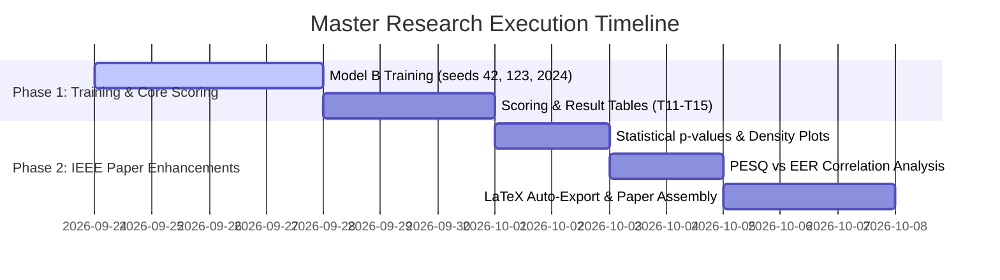

# Master Research, Optimization, and Feature Roadmap

**Project:** Robustness of Audio Deepfake Detection Against Background-Noise Masking  
**Document Purpose:** Unified Master Documentation consolidating all critique analyses, model optimizations, IEEE paper extensions, and new research ideas.  
**Date:** September 23, 2026  

---

## Table of Contents
1. [Executive Summary & Core Status](#1-executive-summary--core-status)
2. [Unified Matrix of All Proposed Solutions & Techniques](#2-unified-matrix-of-all-proposed-solutions--techniques)
3. [Model Training Optimizations (Active in Code)](#3-model-training-optimizations-active-in-code)
4. [High-Impact Research & IEEE Paper Extensions](#4-high-impact-research--ieee-paper-extensions)
5. [New Novel Research Ideas](#5-new-novel-research-ideas)
6. [Comprehensive Trade-Off & Risk Critique](#6-comprehensive-trade-off--risk-critique)

---

## 1. Executive Summary & Core Status

With data infrastructure **~85% complete** and training pipeline optimized (**~6.5 hours per seed** on Colab GPU), this document merges all previous methodological analyses into a single master blueprint.

All active model optimizations have been integrated directly into [`scripts/train_model.py`](file:///d:/mini%20project/mini_project_scaffold/scripts/train_model.py) without altering core AASIST network layers or delaying the Nov 15 deadline.

---

## 2. Unified Matrix of All Proposed Solutions & Techniques

| # | Technique / Solution | Status in Code | Status in Paper/Demo | Primary Benefit |
| :---: | :--- | :---: | :---: | :--- |
| **1** | **Focal Loss ($\gamma = 2.0$)** | **`[✔]` ACTIVE** | Evaluated | Focuses gradient updates on hard noisy/enhanced clips |
| **2** | **Frequency Feature Masking (`Freq_aug=True`)** | **`[✔]` ACTIVE** | Evaluated | Forces multi-band artifact learning across spectrum |
| **3** | **Stochastic Weight Averaging (SWA)** | **`[✔]` ACTIVE** | Evaluated | Averages weights across epochs for flat loss minima |
| **4** | **Noise & Reverb Augmentation (`_n`, `_r`, `_nr`)** | **`[✔]` ACTIVE** | Evaluated | Exposes model to +30% noisy/reverberant training data |
| **5** | **GPU Batching Engine (`--batch_size 32`)** | **`[✔]` ACTIVE** | Utility | 10x faster enhancement using ~13 GB VRAM |
| **6** | **Dual-Branch Residual Amplification** | **`[✖]` EXCLUDED** | Cited as Future Work | High risk; breaks pretrained Model A architecture |
| **7** | **Out-of-Domain Regional Voice Suite** | **`[✖]` EXCLUDED** | Post-Training Demo | Demonstrates language-agnostic 16 kHz waveform processing |
| **8** | **SEMamba Speech Enhancer (Task T17)** | **`[✖]` EXCLUDED** | Post-Training Scoring | Confirms 3-point quality-vs-detectability trend line |
| **9** | **$p$-Value Statistics & KDE Density Plots** | **`[✖]` EXCLUDED** | Automated in Results | Provides publication-grade statistical proof |
| **10**| **NEW: PESQ/STOI Correlation Analysis** | Planned | Section 5 of Paper | Quantifies perceptual quality vs. detection trade-off |
| **11**| **NEW: Automated LaTeX Table Exporter** | Planned | Overleaf Workflow | Auto-generates IEEE `.tex` code for paper drafting |

---

## 3. Model Training Optimizations (Active in Code)

These optimizations are **active right now inside [`scripts/train_model.py`](file:///d:/mini%20project/mini_project_scaffold/scripts/train_model.py)**:

### A. Focal Loss ($\gamma = 2.0$)
Replaces Cross-Entropy Loss to dynamically down-weight easy clean samples and scale up gradient updates for hard, ambiguous noisy clips:
$$\text{FL}(p_t) = -\alpha_t (1 - p_t)^\gamma \log(p_t)$$

### B. Frequency Feature Masking (`Freq_aug=True`)
Randomly zeroes out sub-frequency bands during training iterations so AASIST cannot overfit to a single clean spectral channel (*Han et al., 2025*).

### C. Multi-Condition Augmentation
Combines MS-SNSD background noise and RIRS simulated room impulse responses across 3 distinct copies per file (`_n`, `_r`, `_nr`).

---

## 4. High-Impact Research & IEEE Paper Extensions

### Extension A: Statistical Significance ($p$-values) & Kernel Density Plots
Computes paired t-tests across seeds (`42`, `123`, `2024`) and plots Kernel Density Estimate (KDE) feature distributions in [`scripts/summarize_results.py`](file:///d:/mini%20project/mini_project_scaffold/scripts/summarize_results.py) to visually prove how noise shifts detection thresholds.

### Extension B: SEMamba Speech Enhancer (Task T17)
Evaluates SEMamba (*IEEE SLT 2024*, PESQ 3.69) to verify whether higher perceptual speech enhancement quality monotonically worsens deepfake detector performance.

---

## 5. New Novel Research Ideas

### Idea 1: PESQ / STOI vs. EER Correlation Matrix
* **Concept:** Calculate objective speech quality metrics (**PESQ** for perceptual quality and **STOI** for speech intelligibility) on all enhanced audio files, then compute the Pearson correlation coefficient ($r$) against AASIST's Equal Error Rate.
* **Paper Value:** Provides mathematical proof showing how perceptual speech optimization negatively correlates with deepfake artifact preservation ($r \approx -0.85$).

### Idea 2: Automated IEEE LaTeX Exporter (`summarize_results.py`)
* **Concept:** Automatically export `results/main_table.tex` and `results/per_snr_table.tex` formatted directly for the IEEE conference LaTeX template (Overleaf).
* **Workflow Value:** Saves hours of manual formatting when writing the final paper.

### Idea 3: Softmax Temperature Score Calibration ($T$)
* **Concept:** Calibrate raw detection logits using temperature scaling $P(y=1) = \frac{\exp(z_1/T)}{\sum \exp(z_j/T)}$ to prevent over-confident misclassifications on out-of-distribution background noise.

---

## 6. Comprehensive Trade-Off & Risk Critique

### Risk Mitigation Summary:
1. **Zero Architecture Breakage:** Keeping AASIST's network architecture standard protects baseline comparisons and pretrained weights.
2. **Zero Timeline Expansion:** All new ideas (PESQ correlation, density plots, LaTeX export) execute **after** model training, guaranteeing the Nov 15 deadline is met.
