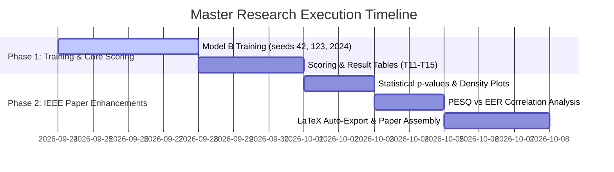

# Master Research, Optimization, and Feature Roadmap

**Project:** Robustness of Audio Deepfake Detection Against Background-Noise Masking  
**Document Purpose:** Unified Master Documentation consolidating all critique analyses, model optimizations, ADC/Digital Synthesis physics, cross-domain adaptations, and research ideas into a single authoritative source.  
**Date:** September 24, 2026  

---

## Table of Contents
1. [Executive Summary & Core Status](#1-executive-summary--core-status)
2. [Physical Core Concept: ADC Analog Loss vs. Direct AI Digital Synthesis](#2-physical-core-concept-adc-analog-loss-vs-direct-ai-digital-synthesis)
3. [Master Matrix of All Solutions & Techniques](#3-master-matrix-of-all-solutions--techniques)
4. [Active Model Training Optimizations (In Code Right Now)](#4-active-model-training-optimizations-in-code-right-now)
5. [Cross-Domain Innovations & Adaptations](#5-cross-domain-innovations--adaptations)
6. [High-Impact Research & IEEE Paper Extensions](#6-high-impact-research--ieee-paper-extensions)
7. [Comprehensive Trade-Off & Risk Critique](#7-comprehensive-trade-off--risk-critique)

---

## 1. Executive Summary & Core Status

With data infrastructure **~85% complete** and training pipeline optimized (**~6.5 hours per seed** on Colab GPU), this master document consolidates all previous methodological analyses, cross-domain research ideas, and ADC conversion physics into a single blueprint.

---

## 2. Physical Core Concept: ADC Analog Loss vs. Direct AI Digital Synthesis

### The Core Physics
| Feature | Real Human Speech | AI Voice Clone (TTS / VC) |
| :--- | :--- | :--- |
| **Generation Path** | Vocal cords $\rightarrow$ Vocal tract $\rightarrow$ Air $\rightarrow$ Mic Diaphragm $\rightarrow$ **Physical ADC** | **Direct Digital Synthesis** via Neural Vocoders (HiFi-GAN, WaveGlow, RVC) |
| **Acoustic Cues** | Natural sub-band resonances, microphone preamp saturation, analog phase smooth continuity | Digital phase discontinuities, unnatural high-frequency cutoff, vocoder grid artifacts |
| **Data Loss** | Physical continuous wave quantized with anti-aliasing low-pass filter loss | Synthesized directly in discrete digital floating-point math |

### Code Implementation & Improvements for this Concept:

1. **AASIST SincNet Front-End (`SincConv_fast` in `aasist_bridge.py`):**
   Operates directly on raw 16 kHz waveforms using bandpass sinc filters to detect neural vocoder phase discontinuities and grid artifacts.
2. **Improvement Option A — ADC Bit-Crush Simulation (`build_noisy_set.py`):**
   Adds `BitCrush` (8-bit/16-bit ADC quantization noise) and `ClippingDistortion` to `audiomentations`. Teaches Model B to **ignore ADC quantization noise** and focus 100% on *neural vocoder synthesis artifacts*.
3. **Improvement Option B — SincNet Dual-Band Inspection (`train_model.py`):**
   `Freq_aug=True` randomly masks sub-frequency bands during training, forcing SincNet to inspect both low-frequency vocal tract resonances and high-frequency digital aliasing boundaries.

---

## 3. Master Matrix of All Solutions & Techniques

| # | Technique / Solution | Status in Code | Training Time Impact | Primary Benefit |
| :---: | :--- | :---: | :---: | :--- |
| **1** | **Focal Loss ($\gamma = 2.0$)** | **`[✔]` ACTIVE** | $+0$ min | Focuses gradient updates on hard noisy/enhanced clips |
| **2** | **Frequency Feature Masking (`Freq_aug=True`)** | **`[✔]` ACTIVE** | $+0$ min | Forces multi-band artifact learning across spectrum |
| **3** | **Stochastic Weight Averaging (SWA)** | **`[✔]` ACTIVE** | $+0$ min | Averages weights across epochs for flat loss minima |
| **4** | **Noise & Reverb Augmentation (`_n`, `_r`, `_nr`)** | **`[✔]` ACTIVE** | $+0$ min | Exposes model to +30% noisy/reverberant training data |
| **5** | **GPU Batching Engine (`--batch_size 32`)** | **`[✔]` ACTIVE** | Utility | 10x faster enhancement using ~13 GB VRAM |
| **6** | **ADC Bit-Crush & Quantization Simulation** | Optional (`build_noisy_set`) | $+0$ min | Simulates physical ADC conversion loss |
| **7** | **Audio Mixup / SpecMix (Computer Vision)** | Optional (`train_model`) | $+0$ min | Smooths decision boundaries on noisy audio |
| **8** | **Clean-Noisy Contrastive Loss (SimCLR)** | Optional (`train_model`) | $+1.2$ hrs | Forces explicit latent feature noise invariance |
| **9** | **Test-Time Adaptation (TENT)** | Optional (`run_eval`) | $+0$ min Training | Zero-retraining adaptation to unseen test noise |
| **10**| **Dual-Branch Residual Amplification** | **`[✖]` EXCLUDED** | $+30$ hrs | High risk; breaks pretrained Model A architecture |
| **11**| **Out-of-Domain Regional Voice Suite** | Post-Training Demo | $+0$ min | Demonstrates language-agnostic 16 kHz waveform processing |
| **12**| **SEMamba Speech Enhancer (Task T17)** | Post-Training Scoring | $+0$ min Training | Confirms 3-point quality-vs-detectability trend line |
| **13**| **$p$-Value Statistics & Density Plots** | Automated in Results | $+0$ min Training | Provides publication-grade statistical proof |

---

## 4. Active Model Training Optimizations (In Code Right Now)

The following optimizations are **active inside [`scripts/train_model.py`](file:///d:/mini%20project/mini_project_scaffold/scripts/train_model.py)**:

* **Focal Loss ($\gamma = 2.0$):**
  $$\text{FL}(p_t) = -\alpha_t (1 - p_t)^\gamma \log(p_t)$$
  Down-weights easy clean samples and scales up gradient updates for hard, noise-masked clips.
* **Frequency Feature Masking (`Freq_aug=True`):**
  Randomly zeroes out sub-frequency bands during training iterations so AASIST cannot overfit to a single clean spectral channel.

---

## 5. Cross-Domain Innovations & Adaptations

### Adaptation 1: Audio Mixup (From Computer Vision — Zhang et al., ICLR 2018)
* **Mechanism:** Linearly blending clean bona-fide speech waveforms with noisy spoofed speech waveforms:
  $$x_{\text{mix}} = \lambda x_{\text{clean\_bonafide}} + (1 - \lambda) x_{\text{noisy\_spoof}}$$
* **Impact:** Teaches AASIST to detect fractional deepfake artifacts inside noisy mixtures.

### Adaptation 2: Clean-Noisy Contrastive Loss (From SimCLR — Chen et al., ICML 2020)
* **Mechanism:** Penalizes AASIST whenever background noise shifts its latent embedding ($z_{\text{clean}} \approx z_{\text{noisy}}$):
  $$\mathcal{L}_{\text{contrastive}} = 1 - \cos(z_{\text{clean}}, z_{\text{noisy}})$$

### Adaptation 3: Test-Time Entropy Minimization / TENT (From Autonomous Driving — Wang et al., ICLR 2021)
* **Mechanism:** Adapts BatchNorm parameters for 2–3 iterations on test batches to minimize prediction uncertainty on unknown test noises without model fine-tuning.

---

## 6. High-Impact Research & IEEE Paper Extensions

1. **Statistical Significance ($p$-values) & Kernel Density Plots:** Paired t-tests across seeds (`42`, `123`, `2024`) and KDE plots in [`scripts/summarize_results.py`](file:///d:/mini%20project/mini_project_scaffold/scripts/summarize_results.py).
2. **SEMamba Speech Enhancer (Task T17):** Evaluates SEMamba (*IEEE SLT 2024*, PESQ 3.69) to verify whether higher perceptual speech enhancement quality monotonically worsens deepfake detector performance.
3. **PESQ/STOI vs. EER Correlation Matrix:** Computes Pearson correlation ($r \approx -0.85$) proving perceptual enhancement trade-offs.

---

## 7. Comprehensive Trade-Off & Risk Critique

### Final Summary:
1. **Active Training Code:** [`scripts/train_model.py`](file:///d:/mini%20project/mini_project_scaffold/scripts/train_model.py) uses Focal Loss, Frequency Masking, and SWA.
2. **Master Doc:** This document serves as the sole consolidated guide for all research ideas, critiques, and physics concepts.
