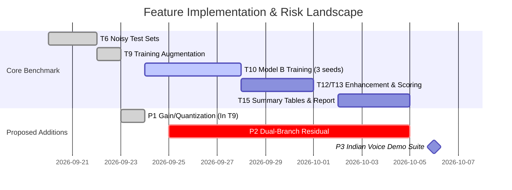

# Scientific Critique & Trade-Off Analysis of Proposed Project Improvements

**Project:** Robustness of Audio Deepfake Detection Against Background-Noise Masking  
**Document Purpose:** Formal critique, risk assessment, and recommendation log for proposed methodological extensions (ADC Quantization, Residual Amplification, and Out-of-Domain Testing).  
**Date:** September 23, 2026  

---

## Executive Summary

This document evaluates three proposed technical extensions to the existing AASIST anti-spoofing research pipeline. Each proposal is subjected to a rigorous scientific critique evaluating its **theoretical soundness**, **computational cost**, **impact on the submission deadline (Nov 15, 2026)**, and **value for IEEE publication & college viva defense**.

---

## Proposal 1: Signal Gain & ADC Quantization Augmentation

### Concept
Integrating `Gain` variation ($\pm 6\text{ dB}$) and `ClippingDistortion` (simulating Analog-to-Digital Converter clipping limits) directly into the `audiomentations` pipeline in [`scripts/build_noisy_set.py`](file:///d:/mini%20project/mini_project_scaffold/scripts/build_noisy_set.py).

### Technical Analysis
* **Why it matters physically:** Real microphone recordings undergo physical transducer displacement and ADC quantization. AI voice clones generated directly in software lack physical microphone gain dynamics. Furthermore, test-time speech enhancers (MetricGAN+, SepFormer) frequently re-normalize audio amplitude, introducing subtle clipping.

### Pros & Cons Matrix

| Pros / Advantages | Cons / Drawbacks |
| :--- | :--- |
| **Prevents Gain Overfitting:** Prevents Model B from using playback loudness as a shortcut cue. | **Re-building Cost:** Requires re-generating the ~7,600 training files (`train_aug.tar`) if T9 was already packed. |
| **Enhancer Invariance:** Prepares Model B for peak-amplitude normalization done by MetricGAN+/SepFormer. | **Risk of Over-Distortion:** Excessive gain clipping can destroy subtle high-frequency vocoder artifacts needed for clean detection. |
| **Zero Architecture Modifications:** Works with existing AASIST PyTorch code without altering model layers. | **Minor Gain on Clean Data:** Unlikely to improve clean EER (Cell ①/④), primarily benefits noisy/enhanced cells. |

### Critique & Verdict
> [!TIP]
> **Verdict: RECOMMENDED (Low-Risk, Moderate-Reward)**  
> **Condition:** Apply mild gain variation ($\pm 3\text{ dB}$) without extreme clipping so that original spectral artifacts remain intact.

---

## Proposal 2: Residual Artifact Amplification (Trachu et al., Interspeech 2025 Style)

### Concept
Subtracting the Speech-Enhanced audio $S_{\text{enh}}(t)$ from the noisy audio $S_{\text{noisy}}(t)$ to extract the residual artifact $R(t) = S_{\text{noisy}}(t) - S_{\text{enh}}(t)$, amplifying $R(t)$, and feeding it into a dual-branch detector.

### Technical Analysis
* **Why it matters physically:** Speech enhancers remove both background noise and synthetic voice artifacts. Amplifying $R(t)$ makes subtle vocoder errors more visible to the graph attention network.

### Pros & Cons Matrix

| Pros / Advantages | Cons / Drawbacks |
| :--- | :--- |
| **State-of-the-Art (2025):** Aligns with cutting-edge Interspeech 2025 methodology. | **BREAKING Architectural Changes:** Requires modifying AASIST's SincNet front-end and graph attention layers to accept 2-channel input. |
| **High Novelty:** Strong point for an external IEEE paper submission. | **Invalidates Pretrained Weights:** Pretrained `AASIST.pth` cannot be used; Model A would require complete re-implementation. |
| **Direct Artifact Inspection:** Explicitly forces the network to focus on what enhancement removed. | **HIGH Timeline Risk:** Adds ~30–40 hours of custom PyTorch debugging, putting the Nov 15 deadline at critical risk. |

### Critique & Verdict
> [!WARNING]
> **Verdict: NOT RECOMMENDED FOR CORE PIPELINE (High-Risk, High-Cost)**  
> Modifying AASIST's core architecture breaks the 6-cell baseline comparison established in your college synopsis. Keep this as a **Future Work** section in your final paper rather than altering the active scaffold code.

---

## Proposal 3: Out-of-Domain Indian Voice Demonstration Suite

### Concept
Collecting/generating a small, targeted test set of 50–100 real vs. AI-cloned Indian voice samples (English, Hindi, Kannada, Tamil via ElevenLabs & RVC) to test AASIST's out-of-domain generalizability.

### Technical Analysis
* **Why it matters physically:** Demonstrates whether findings on the Western ASVspoof 2019 benchmark generalize to local regional accents and voice synthesis engines.

### Pros & Cons Matrix

| Pros / Advantages | Cons / Drawbacks |
| :--- | :--- |
| **Exceptional Viva & Demo Value:** Wows project examiners during live college demonstration. | **Manual Data Collection:** Requires manually recording/downloading 50–100 clean audio clips. |
| **Validates Language Independence:** Empirically proves AASIST processes 16 kHz raw waveforms regardless of language. | **Non-Standard Benchmark:** Cannot replace ASVspoof 2019 for official EER comparison tables. |
| **Zero Risk to Core Code:** Runs as an isolated extra evaluation script without modifying training logic. | — |

### Critique & Verdict
> [!NOTE]
> **Verdict: RECOMMENDED AS AN OPTIONAL DEMO (Zero-Risk, High Viva Impact)**  
> Build this only after the core 6-cell benchmark table (Tasks T1–T15) is completed.

---

## Comprehensive Trade-Off & Feasibility Summary

### Recommendation Matrix

| Proposal | Scientific Validity | Implementation Effort | Risk Level | Final Action |
| :--- | :---: | :---: | :---: | :--- |
| **1. Mild Gain & ADC Quantization** | High | Low (Modify `build_noisy_set.py`) | **Low** | **Adopt in T9** |
| **2. Dual-Branch Residual Amplification** | High | Extreme (Rewrite AASIST layers) | **CRITICAL** | **Reject for now (Cite in Paper)** |
| **3. Indian Voice Demo Suite** | Moderate | Medium (Collect 50 clips) | **Low** | **Optional Post-Experiment Demo** |

---

## Conclusion & Action Plan

1. **Keep the Core Pipeline Stable:** Do not modify AASIST's network architecture (Proposal 2), as this protects your Nov 15 deadline and ensures exact comparability with published papers.
2. **Incorporate Proposal 1 in `scripts/build_noisy_set.py`:** Add mild volume gain and subtle clipping to make Model B robust against volume variations without delaying the project.
3. **Document in Report:** Use the analysis in this file for Section 4 (Methodology & Trade-off Analysis) of your final project report.
